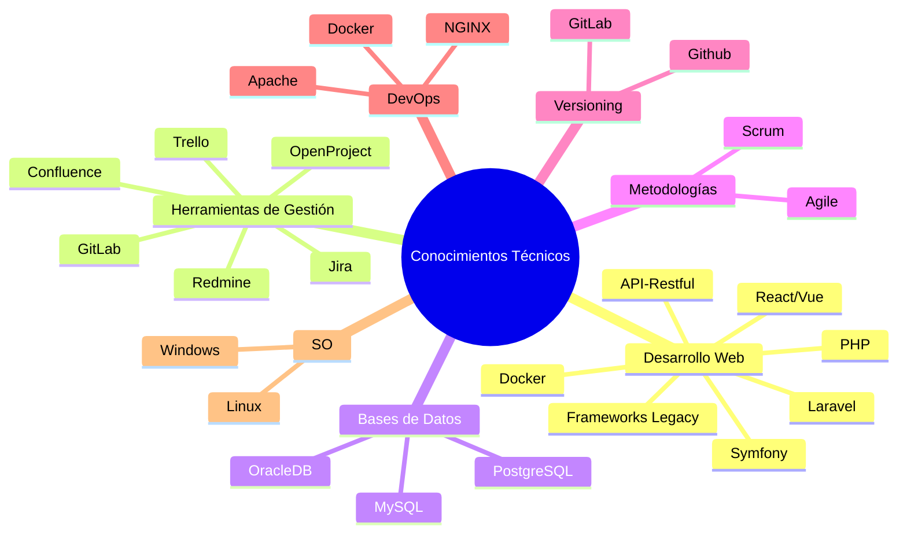

>[Volver al inicio](https://github.com/IngJuanRojas/about-me-Es/tree/main)
## **Conocimientos Técnicos:**
- **Desarrollo Web:** PHP, Frameworks Legacy, Symfony, Laravel, React/Vue, API-Restful, Docker
- **Herramientas de Gestión:** Jira, Trello, Confluence, Redmine, OpenProject, GitLab
- **Bases de Datos:** MySQL, PostgreSQL, OracleDB
- **Metodologías:** Scrum, Agile
- **Versioning:** GitLab, Github
- **DevOps:** Docker, Apache, NGINX
- **SO:** Linex, Windows

### **MindMap de Conocimientos Técnicos**

## **Habilidades Blandas**
- **Liderazgo y Gestión de Equipos**: Habilidad para liderar y motivar equipos, delegar tareas efectivamente y gestionar recursos para alcanzar objetivos en tiempo y forma.
- **Comunicación Efectiva**: Capacidad para traducir necesidades técnicas a términos comprensibles para stakeholders y usuarios, asegurando una clara comprensión de los objetivos y requisitos.
- **Resolución de Problemas**: Enfoque proactivo para identificar, analizar y resolver problemas técnicos y de gestión, minimizando riesgos y asegurando la continuidad del proyecto.
- **Pensamiento Estratégico**: Visión para desarrollar estrategias que alineen la tecnología con los objetivos de negocio, maximicen la eficiencia y promuevan la innovación.
- **Gestión del Cambio**: Experiencia en gestionar el cambio organizacional, implementando nuevas tecnologías y metodologías sin afectar la productividad del equipo.
- **Colaboración y Trabajo en Equipo**: Competencia para colaborar con equipos multifuncionales, asegurando un entorno de trabajo cohesivo y orientado al éxito del proyecto.
- **Adaptabilidad**: Capacidad para ajustarse rápidamente a nuevos entornos, tecnologías y metodologías, garantizando la entrega eficiente y eficaz de soluciones.
- **Planificación y Organización**: Habilidad para planificar, organizar y priorizar tareas, manteniendo la calidad y cumpliendo con los plazos establecidos.

## **Formación Académica**

**Ingeniero en Informática**  
*Universidad Rómulo Gallegos, Venezuela*  
*2010*

**Web Developer**  
*IBM, Venezuela*  
*2012*

**Certificaciones en Data Analytics & Digital Marketing**  
*IAB Spain, España*  
*2015*

## **Logros**

### **Gestión de Productos**
- **Desarrollo de Visión del Producto**: Convertí las necesidades de los stakeholders en características del producto, aumentando la satisfacción del cliente en un 20%.
- **Priorización Eficiente del Backlog**: Definí y prioricé el backlog basado en la retroalimentación del cliente, mejorando la eficiencia de desarrollo en un 25%.
- **Liderazgo en Innovación del Producto**: Dirigí la adopción de nuevas tecnologías y metodologías, incrementando la adaptabilidad y escalabilidad del producto.

### **Gestión Técnica**
- **Optimización de Procesos Técnicos**: Implementé mejoras en la arquitectura del producto, lo que resultó en un aumento del 30% en la eficiencia del equipo de desarrollo.
- **Coordinación y Motivación de Equipos**: Gestioné equipos multiculturales, logrando alta cohesión y motivación, y superando consistentemente los objetivos de entrega de producto.
- **Adopción de Symfony**: Lideré la integración de Symfony en la infraestructura existente, reduciendo el tiempo de desarrollo en un 40%.
- **Reducción de Errores de Producción**: Introduje una metodología de testing mejorada, reduciendo los errores en producción en un 40%.
- **Implementación de Soluciones Escalables**: Desarrollé y desplegué soluciones escalables basadas en Docker, mejorando la gestión de despliegues y la eficiencia operativa.
- **Mejora en Gestión de Datos**: Implementé soluciones avanzadas de gestión de datos, mejorando la coherencia y calidad de la información en aplicaciones críticas. De esta forma colaborando con la reduccion de mas de 10 millones de registros incoherentes en base de datos.

## **Idiomas**
- **Español**: Nativo
- **Francés**: Avanzado
- **Inglés**: Avanzado
- **Portugués**: Básico
